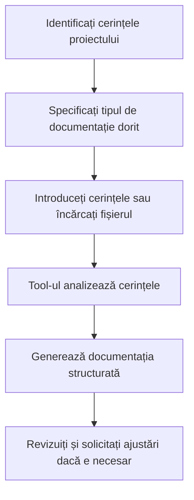

# DocumentFlow - Cum să Generați Documentație

## Ce Face Acest Tool?
**DocumentFlow** vă ajută să creați documentație profesională automat. Îi spuneți ce proiect aveți și el vă face planuri detaliate, documentație tehnică și chiar diagrame. Perfect când trebuie să scrieți documente oficiale pentru proiecte sau când vreti să organizați ideile într-un format profesional.

## Pregătire (pentru Administratori)

Pentru ca acest tool să funcționeze, administratorul trebuie să:
- **Ruleze serviciul DocumentFlow** 
- **Activeze tool-urile personalizate** în sistem


💡 **Pentru utilizatori**: Dacă tool-ul nu creează documentație, contactați administratorul!


## Cum să Folosești Tool-ul

### 1. Generarea Documentației din Text Direct

#### Exemplu Simplu
```
@document_flow generează documentația pentru un sistem de management al clienților
```

#### Exemplu cu Specificații
```
@document_flow generează un PRD pentru o aplicație de e-commerce cu funcționalități de plată online, gestionare produse și raportare
```


```

### 2. Generarea Documentației din Fișiere

#### Pasul 1: Încărcați fișierul
- Faceți clic pe iconița de ataș 📎 în bara de mesaje
- Selectați "Upload files" din meniu
- Alegeți documentul dorit (DOCX, PDF)

#### Pasul 2: Cerați generarea documentației
```
Te rog să generezi documentația din fișierul încărcat
```

sau mai specific:
```
Generează un PRD și execution plan din cerințele din fișierul încărcat
```

### 3. Tipuri de Documentație

#### a) PRD (Product Requirements Document)
```
Generează un PRD pentru [descrierea produsului]
```

#### b) Execution Plan
```
Creează un execution plan pentru [proiectul/implementarea]
```

#### c) Diagrame PlantUML
```
Generează diagrame PlantUML pentru [arhitectura sistemului]
```

#### d) Documentație Completă
```
Generează toată documentația (PRD, execution plan, diagrame) pentru [proiectul]
```

### 4. Formate de Returnare

#### a) Text (Implicit)
```
Generează documentația în format text
```

#### b) PDF
```
Generează documentația în format PDF pentru download
```

### 5. Exemple Practice

#### Exemplu 1: Sistem de Management al Clienților
```
@document_flow generează documentația completă pentru un sistem CRM cu:
- Gestionarea contactelor clienți
- Urmărirea vânzărilor
- Raportare și analytics
- Integrare cu sisteme externe
```

#### Exemplu 2: Aplicație Mobile
```
@document_flow generează un PRD pentru o aplicație de delivery food cu:
- Autentificare utilizatori
- Căutare restaurante
- Comandă și plată online
- Tracking livrare în timp real
```

#### Exemplu 3: Procesare Fișier
1. Încărcați documentul cu cerințele prin interfață
2. Scrieți: `Generează documentația tehnică din cerințele din fișierul încărcat, inclusiv diagrame de arhitectură`

#### Exemplu 4: Proiect de Migrare
```
@document_flow generează un execution plan pentru migrarea unui sistem legacy în cloud:
- Analiza sistemului existent
- Plan de migrare în faze
- Testare și validare
- Rollback plan
```

### 6. Tipuri de Fișiere Suportate

| Tip | Extensii | Descriere | Avantaje |
|-----|----------|-----------|----------|
| PDF | .pdf | Documente portabile | Extragere text cu formatare |
| Word | .docx | Documente Microsoft Word | Procesare structură completă |

### 7. Caracteristici Avansate

#### Generare Inteligentă de Documentație
- Analizează cerințele și generează documentație structurată
- Adaptează stilul la tipul de proiect
- Include secțiuni relevante automat

#### Diagrame PlantUML
- Generează diagrame de arhitectură
- Diagrame de flux pentru procese
- Diagrame de entități pentru baze de date

#### Formatare Profesională
- Structură consistentă și profesională
- Secțiuni clare și organizate
- Formatare adaptată la tipul de document

## Opțiuni de Personalizare

### Tipul de Documentație
```
Generează doar PRD pentru [proiectul]
```
```
Generează doar execution plan pentru [implementarea]
```
```
Generează doar diagrame pentru [arhitectura]
```

### Formatul de Returnare
```
Generează documentația în format text
```
```
Generează documentația în format PDF
```

### Specificarea Cerințelor
```
Generează documentația pentru un sistem de facturare cu:
- Gestionarea clienților și furnizorilor
- Generarea facturilor și chitanțelor
- Raportare financiară
- Integrare cu sisteme contabile
```

## Rezolvarea Problemelor

### Eroarea "DOCUMENT_FLOW_API_URL nu este configurat"
**Soluție**: Setați variabila de mediu în `.env`:
```bash
DOCUMENT_FLOW_API_URL=http://localhost:8003
```

### Eroarea "Tip de fișier nesuportat"
**Soluție**: Folosiți doar fișiere DOCX sau PDF. Convertiți alte formate înainte de încărcare.

### Eroarea "Cerințele furnizate sunt goale"
**Soluție**: Asigurați-vă că furnizați cerințe clare și detaliate pentru generarea documentației.

### Eroarea "Nu se poate conecta la serviciul DocuFlow"
**Soluție**: 
1. Verificați că serviciul DocumentFlow rulează
2. Confirmați URL-ul în `DOCUMENT_FLOW_API_URL`
3. Testați conectivitatea cu `curl http://localhost:8003/health`

### Documentația generată este prea generică
**Soluție**: Specificați mai clar cerințele:
```
Generează documentația pentru [proiectul specific] cu focus pe [aspectele importante]
```

## Sfaturi pentru Utilizare Optimă

1. **Specificați cerințele clar** - "pentru un sistem de e-commerce", "pentru o aplicație mobile"
2. **Indicați tipul de documentație** - "PRD", "execution plan", "diagrame"
3. **Specificați formatul dorit** - "în format PDF", "în format text"
4. **Folosiți fișiere cu cerințe clare** - evitați documente ambigue
5. **Testați cu proiecte mai mici** - pentru a înțelege stilul tool-ului

## Workflow Recomandat



## Exemple de Rezultate

### Input: Cerințe pentru sistem CRM
### Output: 
```
PRODUCT REQUIREMENTS DOCUMENT (PRD)
Sistem de Management al Relațiilor cu Clienții (CRM)

1. OVERVIEW
   - Scop: Gestionarea eficientă a relațiilor cu clienții
   - Obiectiv: Creșterea vânzărilor prin managementul contactelor și oportunităților

2. FUNCȚIONALITĂȚI PRINCIPALE
   - Gestionarea contactelor clienți
   - Urmărirea oportunităților de vânzare
   - Generarea de rapoarte și analytics
   - Integrare cu sisteme externe

3. CERINȚE TEHNICE
   - Arhitectură web-based
   - Baza de date relațională
   - API REST pentru integrare
   - Interfață responsivă

4. CRITERII DE SUCCES
   - Reducerea timpului de procesare cu 50%
   - Creșterea ratei de conversie cu 25%
   - Satisfacția utilizatorilor > 90%
```

### Input: Fișier DOCX cu cerințe
### Output:
```
EXECUTION PLAN
Implementarea Sistemului CRM

Faza 1: Analiza și Planificare (2 săptămâni)
- Analiza cerințelor detaliate
- Designul arhitecturii
- Planificarea resurselor

Faza 2: Dezvoltare (8 săptămâni)
- Dezvoltarea backend
- Implementarea frontend
- Integrarea sistemelor

Faza 3: Testare și Validare (2 săptămâni)
- Testare funcțională
- Testare de performanță
- Validarea cu utilizatorii

Faza 4: Lansare (1 săptămână)
- Deployment în producție
- Training utilizatori
- Monitorizare și suport
```

Acest tool este ideal pentru echipile de dezvoltare, managerii de proiect și analiștii de business care au nevoie de documentație profesională generată rapid și eficient din cerințe.
