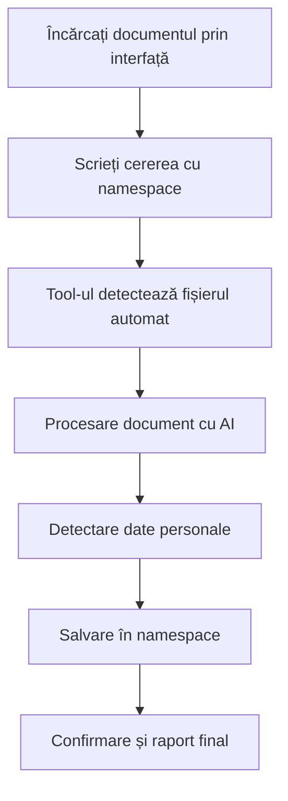

# DocumentLoader - Cum să Încărcați Documente

## Ce Face Acest Tool?
**DocumentLoader** vă ajută să încărcați și să organizați documentele în LibreChat. Puteți încărca fișiere PDF, Word, Excel și chiar pagini din Notion sau Confluence. Toate documentele sunt organizate în dosare (numite "namespace-uri") pentru a le găsi mai ușor.

## Pregătire (pentru Administratori)

Pentru ca acest tool să funcționeze, administratorul trebuie să facă câteva setări:

### Ce Trebuie Configurat
- **Serviciul DocumentLoader** trebuie să ruleze (de obicei la adresa http://localhost:8000)
- **Încărcarea fișierelor** trebuie să fie activată în sistem  
- **Tipurile de fișiere suportate** trebuie să includă PDF, Word, Excel

💡 **Pentru utilizatori**: Dacă nu puteți încărca fișiere, vorbiti cu administratorul sistemului!

<details>
<summary>📋 Detalii tehnice pentru administratori (click pentru a deschide)</summary>

```bash
# Variabile de mediu necesare
DOCUMENT_LOADER_BASE_URL=http://localhost:8000
```

```yaml
# Configurare în librechat.yaml
agents:
  capabilities:
    - document_loader

fileConfig:
  endpoints:
    agents:
      disabled: false
      fileLimit: 20
      fileSizeLimit: 25MB
      allowMessageAttachments: true

documentLoader:
  enabled: true
  baseUrl: ${DOCUMENT_LOADER_BASE_URL}
  maxFileSize: 50MB
  features:
    uploadFiles: true
```
</details>

## Cum să Folosești Tool-ul

### 1. Încărcarea Documentelor din Interfață

#### Pasul 1: Încărcați fișierul
- Faceți clic pe iconița de ataș 📎 în bara de mesaje
- Selectați "Upload files" din meniu
- Alegeți documentul dorit (PDF, DOCX, Excel)

#### Pasul 2: Cerați procesarea
Scrieți un mesaj cum ar fi:
```
Te rog să încarci documentul în namespace-ul "analiza-proiect"
```

### 2. Ce Puteți Face cu Tool-ul

#### 📄 Încărcarea Documentelor (cel mai folosit)
După ce ați încărcat un fișier prin interfață, scrieți:
```
Încarcă documentul în dosarul "contracte"
```
Tool-ul va găsi automat fișierul și îl va procesa.

#### 🌐 Import din Notion
Dacă aveți o pagină importantă în Notion:
```
Importă pagina https://notion.so/pagina-mea în dosarul "documentatie"
```

#### 📋 Import din Confluence  
Pentru paginile din wiki-ul companiei:
```
Importă pagina https://wiki.compania.com/proceduri în dosarul "procese"
```

#### 📁 Gestionarea Dosarelor (namespace-uri)
Pentru a vedea toate dosarele existente:
```
Arată-mi toate dosarele disponibile
```

Pentru a crea un dosar nou:
```
Creează dosarul nou "proiect-2024"
```

### 3. Exemple Practice

#### Exemplu 1: Analiza unui Contract
1. Încărcați contractul PDF prin interfață
2. Scrieți: `Te rog să încarci contractul în namespace-ul "contracte-2024" pentru analiză ulterioară`

#### Exemplu 2: Procesarea unor Documente Excel
1. Încărcați fișierul Excel prin interfață
2. Scrieți: `Încarcă raportul financiar în namespace-ul "financiar-q4"`

#### Exemplu 3: Import Documentație
```
Importă documentația de la https://notion.so/company/api-docs în namespace-ul "api-documentation"
```

### 4. Tipuri de Fișiere Suportate

| Tip | Extensii | Dimensiune Max | Descriere |
|-----|----------|----------------|-----------|
| PDF | .pdf | 50MB | Documente portable |
| Word | .docx, .doc | 50MB | Documente Microsoft Word |
| Excel | .xlsx, .xls | 50MB | Foi de calcul Excel |
| Text | .txt | 50MB | Fișiere text simplu |

### 5. Caracteristici Avansate

#### Detectare Automată Date Personale
Tool-ul detectează și raportează automat:
- Numere de telefon
- Adrese email
- CNP-uri
- Adrese fizice

#### Organizare în Namespace-uri
- Namespace-urile permit organizarea documentelor pe categorii
- Minimum 3 caractere, maximum 32 caractere
- Folosiți nume descriptive: "contracte-2024", "resurse-umane", "analiza-piata"

#### Procesare Inteligentă
- Extragere automată de text din PDF-uri
- Procesare tabele Excel cu păstrarea structurii
- Suport pentru documente Word complexe

## Când Ceva Nu Merge

### ❌ "Nu pot încărca fișierul"
**Ce să faceți**: 
- Verificați că fișierul este PDF, Word sau Excel
- Asigurați-vă că fișierul nu e mai mare de 50MB
- Dacă problema persistă, contactați administratorul

### ❌ "Tip de fișier neacceptat"  
**Ce să faceți**: 
- Folosiți doar fișiere PDF (.pdf), Word (.docx) sau Excel (.xlsx)
- Convertiți fișierul în unul din formatele acceptate

### ❌ "Fișierul este prea mare"
**Ce să faceți**:
- Reduceți dimensiunea fișierului (compresia PDF, eliminarea imaginilor mari)
- Împărțiți documentul în mai multe fișiere mai mici

### ❌ Tool-ul nu răspunde deloc
**Ce să faceți**:
- Verificați că ați încărcat fișierul corect prin interfață
- Încercați din nou cu un mesaj mai simplu: "Încarcă documentul"
- Contactați administratorul dacă problema continuă

## Sfaturi pentru Utilizare Optimă

1. **Folosiți namespace-uri descriptive** - `analiza-financiara-2024` în loc de `docs`
2. **Încărcați documentele prin interfață** - este mai simplu și mai sigur
3. **Verificați întotdeauna rezultatul** - tool-ul raportează dacă încărcarea a fost reușită
4. **Organizați documentele logic** - folosiți namespace-uri pentru proiecte sau departamente
5. **Monitorizați datele personale** - tool-ul vă alertează asupra prezenței acestora

## Workflow Recomandat



Acest tool este ideal pentru organizarea și procesarea inteligentă a documentelor în organizația dvs., oferind transparență completă asupra conținutului și siguranței datelor.
