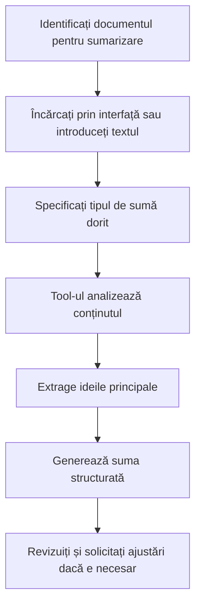

# DocumentSummarizer - Cum să Faceți Rezumate

## Ce Face Acest Tool?
**DocumentSummarizer** vă ajută să faceți rezumate rapide și clare din documente lungi. Puteți să-l folosiți cu fișiere PDF, Word sau chiar cu text pe care îl scrieți direct. Perfect când aveți un document lung și vreti să aflați rapid despre ce e vorba.

## Pregătire (pentru Administratori)

Pentru ca acest tool să funcționeze, administratorul trebuie să:
- **Activeze serviciul DocumentSummarizer** (de obicei la http://localhost:8001)
- **Permită încărcarea fișierelor** în sistem
- **Suporte formatele PDF, Word și text**

💡 **Pentru utilizatori**: Dacă tool-ul nu merge, vorbiți cu administratorul!

<details>
<summary>📋 Detalii tehnice pentru administratori (click pentru a deschide)</summary>

```bash
# Variabile de mediu necesare
DOCUMENT_SUMMARIZER_API_URL=http://localhost:8001
```

```yaml
# Configurare în librechat.yaml
agents:
  capabilities:
    - tools

fileConfig:
  endpoints:
    agents:
      disabled: false
      fileLimit: 20
      fileSizeLimit: 25MB
      allowMessageAttachments: true
```
</details>

## Cum să Folosești Tool-ul

### 1. Sumarizarea Textului Direct

#### Exemplu Simplu
```
@document_summarizer sumarizează următorul text: "Aici vine textul lung pe care vrei să-l sumarizezi..."
```

#### Exemplu cu Context
```
Te rog să faci o sumă a acestui articol:

[Textul articolului aici...]

Vreau o sumă de maximum 3 paragrafe care să cuprindă ideile principale.
```

### 2. Sumarizarea Documentelor din Interfață

#### Pasul 1: Încărcați fișierul
- Faceți clic pe iconița de ataș 📎 în bara de mesaje
- Selectați "Upload files" din meniu
- Alegeți documentul dorit (PDF, DOCX, DOC, TXT)

#### Pasul 2: Cerați sumarizarea
```
Te rog să sumarizezi documentul încărcat
```

sau mai specific:
```
Creează o sumă executivă a documentului încărcat, concentrându-te pe concluziile principale
```

### 3. Tipuri de Sumarizări

#### a) Sumă Standard
```
Sumarizează documentul în 2-3 paragrafe
```

#### b) Sumă Executivă
```
Creează o sumă executivă pentru management cu punctele cheie și recomandările
```

#### c) Sumă Tehnică
```
Fă o sumă tehnică concentrată pe aspectele metodologice și rezultatele concrete
```

#### d) Sumă cu Focus Specific
```
Sumarizează documentul concentrându-te pe aspectele financiare și impactul bugetar
```

### 4. Exemple Practice

#### Exemplu 1: Sumarizarea unui Raport
1. Încărcați raportul PDF prin interfață
2. Scrieți: `Te rog să creezi o sumă executivă a raportului, evidențiind recomandările principale și impactul asupra organizației`

#### Exemplu 2: Sumarizarea unui Contract
1. Încărcați contractul DOCX prin interfață
2. Scrieți: `Sumarizează contractul evidențiind obligațiile părților, termenele importante și clauzele de risc`

#### Exemplu 3: Sumarizarea unei Cercetări
```
Fă o sumă academică a acestei cercetări:

[Textul cercetării...]

Include metodologia, rezultatele principale și concluziile.
```

#### Exemplu 4: Sumă Multilingvă
```
Sumarizează documentul și furnizează suma atât în română cât și în engleză
```

### 5. Tipuri de Fișiere Suportate

| Tip | Extensii | Descriere | Avantaje |
|-----|----------|-----------|----------|
| PDF | .pdf | Documente portabile | Extragere text cu formatare |
| Word | .docx, .doc | Documente Microsoft Word | Procesare structură completă |
| Text | .txt | Fișiere text simplu | Procesare rapidă, precisă |

### 6. Caracteristici Avansate

#### Detectare Automată Structură Document
- Identifică titluri și sub-titluri
- Recunoaște liste și enumerări
- Păstrează ierarhia informațiilor

#### Sumarizare Inteligentă
- Extrage ideile principale automat
- Păstrează contextul și coerența
- Adaptează stilul la tipul documentului

#### Procesare Multi-Format
- PDF cu text și imagini
- Documente Word cu formatare complexă
- Fișiere text cu structură variată

## Opțiuni de Personalizare

### Lungimea Sumarizării
```
Creează o sumă scurtă în maximum 1 paragraf
```
```
Fă o sumă detaliată în 5-6 paragrafe
```
```
Sumarizează în maximum 200 de cuvinte
```

### Stilul Sumarizării
```
Creează o sumă în stil jurnalistic cu titluri și sub-titluri
```
```
Fă o sumă tehnică pentru specialiști IT
```
```
Sumarizează în termeni simpli pentru management
```

### Focus pe Elemente Specifice
```
Sumarizează concentrându-te pe aspectele legale și de conformitate
```
```
Extrage și sumarizează doar concluziile și recomandările
```
```
Fă focus pe cifrele și statisticile importante
```

## Rezolvarea Problemelor

### Eroarea "DOCUMENT_SUMMARIZER_API_URL nu este configurat"
**Soluție**: Setați variabila de mediu în `.env`:
```bash
DOCUMENT_SUMMARIZER_API_URL=http://localhost:8001
```

### Eroarea "Tip de fișier nesuportat"
**Soluție**: Folosiți doar fișiere PDF, DOCX, DOC sau TXT. Convertiți alte formate înainte de încărcare.

### Eroarea "Textul furnizat este gol"
**Soluție**: Verificați că documentul conține text extractabil și nu doar imagini.

### Eroarea "Nu se poate conecta la serviciul Document Summarizer"
**Soluție**: 
1. Verificați că serviciul DocumentSummarizer rulează
2. Confirmați URL-ul în `DOCUMENT_SUMMARIZER_API_URL`
3. Testați conectivitatea cu `curl http://localhost:8001/health`

### Suma este prea generică
**Soluție**: Specificați mai clar ce vreți în sumă:
```
Creează o sumă focalizată pe [aspectul specific], evidențiind [elementele importante]
```

## Sfaturi pentru Utilizare Optimă

1. **Specificați contextul** - "Pentru prezentarea către board", "Pentru echipa tehnică"
2. **Indicați lungimea dorită** - "în 3 paragrafe", "maximum 150 cuvinte"
3. **Solicitați elemente specifice** - "cu recomandări concrete", "cu cifrele importante"
4. **Folosiți fișiere cu text clar** - evitați scan-urile de calitate proastă
5. **Testați cu documente mai mici** - pentru a înțelege stilul tool-ului

## Workflow Recomandat



## Exemple de Rezultate

### Input: Raport tehnic de 50 pagini
### Output: 
```
SUMĂ EXECUTIVĂ

Proiectul de modernizare IT a fost finalizat cu succes, realizând 85% din obiectivele propuse 
în termenul stabilit. Investiția de 2.3 milioane EUR a generat economii estimate la 800.000 EUR anual.

ASPECTE CHEIE:
- Implementarea noului sistem ERP a crescut eficiența operațională cu 40%
- Migrarea în cloud a redus costurile infrastructurii cu 60%
- Formarea angajaților a fost realizată pentru 95% din personal

RECOMANDĂRI:
- Extinderea soluției la toate departamentele până în Q2 2024
- Implementarea sistemului de backup îmbunătățit
- Monitorizarea continuă a performanțelor prin KPI-uri definite
```

Acest tool este ideal pentru procesarea rapidă a informațiilor din documente voluminoase, economisind timp prețios și oferind perspective clare asupra conținutului esențial.
