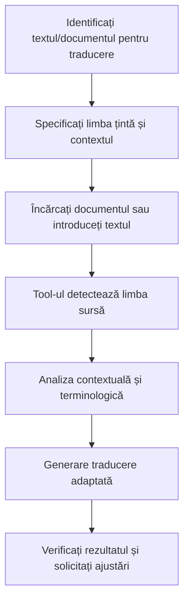

# TextTranslator - Cum să Traduceți Texte

## Ce Face Acest Tool?
**TextTranslator** vă ajută să traduceți texte și documente în diferite limbi. Puteți traduce atât texte pe care le scrieți direct, cât și documente PDF sau Word. Tool-ul ghicește automat din ce limbă traduceți și vă oferă traduceri de calitate bună.

## Pregătire (pentru Administratori)

Pentru ca acest tool să funcționeze, administratorul trebuie să:
- **Pornească serviciul TextTranslator** (de obicei la http://localhost:8002)
- **Activeze încărcarea de fișiere** în sistem
- **Suporte formatele PDF, Word și text simplu**

💡 **Pentru utilizatori**: Dacă nu puteți traduce, contactați administratorul!

<details>
<summary>📋 Detalii tehnice pentru administratori (click pentru a deschide)</summary>

```bash
# Variabile de mediu necesare
TEXT_TRANSLATOR_API_URL=http://localhost:8002
```

```yaml
# Configurare în librechat.yaml
agents:
  capabilities:
    - tools

fileConfig:
  endpoints:
    agents:
      disabled: false
      fileLimit: 20
      fileSizeLimit: 25MB
      allowMessageAttachments: true
```
</details>

## Cum să Folosești Tool-ul

### 1. Traducerea Textului Direct

#### Exemplu Simplu
```
@text_translator traduce în engleză: "Acesta este un text de test pentru traducere"
```

#### Exemplu cu Limba Specificată
```
Te rog să traduci următorul text în franceză:

"Compania noastră oferă servicii de consultanță IT de înaltă calitate pentru organizații din sectorul public și privat."
```

#### Exemplu Multilingv
```
Traduce acest text în germană, spaniolă și italiană:

"Vă mulțumim pentru participarea la conferința noastră anuală."
```

### 2. Traducerea Documentelor din Interfață

#### Pasul 1: Încărcați fișierul
- Faceți clic pe iconița de ataș 📎 în bara de mesaje
- Selectați "Upload files" din meniu
- Alegeți documentul dorit (PDF, DOCX, DOC, TXT)

#### Pasul 2: Cerați traducerea
```
Te rog să traduci documentul încărcat în engleză
```

sau mai specific:
```
Traduce contractul încărcat în engleză, păstrând terminologia juridică corectă
```

### 3. Limbi Suportate

| Limba | Cod | Exemple de Folosire |
|-------|-----|-------------------|
| Română | ro | `traduce în română` |
| Engleză | en | `translate to English` |
| Franceză | fr | `traduce în franceză` |
| Germană | de | `translate to German` |
| Spaniolă | es | `traduce în spaniolă` |
| Italiană | it | `translate to Italian` |
| Portugheză | pt | `traduce în portugheză` |
| Rusă | ru | `translate to Russian` |
| Chineză | zh | `translate to Chinese` |
| Japoneză | ja | `translate to Japanese` |

### 4. Tipuri de Traduceri

#### a) Traducere Standard
```
Traduce textul în engleză
```

#### b) Traducere Profesională/Tehnică
```
Traduce documentul tehnic în engleză, păstrând terminologia IT specifică
```

#### c) Traducere Juridică
```
Traduce contractul în franceză, respectând terminologia juridică corectă
```

#### d) Traducere Marketing
```
Traduce materiatul de marketing în germană, adaptând tonul pentru publicul german
```

### 5. Exemple Practice

#### Exemplu 1: Email Business
```
Traduce acest email în engleză pentru client:

"Dragă domnule Smith,

Vă confirmăm primirea comenzii dumneavoastră. Produsele vor fi livrate în termen de 5 zile lucrătoare.

Cu stimă,
Echipa de vânzări"
```

#### Exemplu 2: Contract Legal
1. Încărcați contractul PDF prin interfață
2. Scrieți: `Te rog să traduci contractul în engleză, păstrând cu atenție clauzele juridice și terminologia legală`

#### Exemplu 3: Prezentare Corporativă
1. Încărcați prezentarea DOCX prin interfață
2. Scrieți: `Traduce prezentarea în franceză pentru meeting-ul cu partenerii din Franța, adaptând stilul pentru auditoriul francez`

#### Exemplu 4: Manual Tehnic
```
Traduce această secțiune din manual în germană:

"Pentru a configura sistemul, urmați următorii pași:
1. Accesați panoul de administrare
2. Selectați modulul de configurare
3. Introduceți parametrii necesari"
```

### 6. Caracteristici Avansate

#### Detectare Automată Limbă Sursă
- Tool-ul detectează automat limba originalului
- Nu e nevoie să specificați limba sursă
- Funcționează cu texte mixte

#### Păstrarea Formatării
- Menține structura documentului original
- Păstrează formatarea (bold, italic, liste)
- Respectă layout-ul paragrafelor

#### Traducere Contextuală
- Înțelege contextul pentru traduceri precise
- Adaptează terminologia la domeniu
- Păstrează sensul și nuanțele

#### Verificarea Calității
- Raportează încrederea în traducere
- Identifică termenii ambigui
- Sugerează alternative când e cazul

## Opțiuni de Personalizare

### Specificarea Stilului
```
Traduce în engleză într-un stil formal pentru corespondența oficială
```
```
Traduce în franceză într-un ton prietenos pentru newsletter-ul companiei
```
```
Traduce în germană folosind terminologia tehnică IT standard
```

### Adaptarea Culturală
```
Traduce în spaniolă adaptând expresiile pentru piața din America Latină
```
```
Traduce în engleză americană pentru publicul din SUA
```
```
Traduce în franceză pentru Canada, respectând particularitățile locale
```

### Traduceri Specializate
```
Traduce documentul medical în engleză folosind terminologia medicală corectă
```
```
Traduce raportul financiar în germană păstrând standardele contabile europene
```
```
Traduce contractul în italiană respectând legislația UE
```

## Verificarea și Îmbunătățirea Traducerilor

### Solicitarea Variante Alternative
```
Oferă 2-3 variante de traducere pentru această propoziție în engleză
```

### Explicarea Alegerii Traducerii
```
Traduce și explică de ce ai ales această formulare în loc de traducerea literală
```

### Verificarea Specificului Cultural
```
Traduce și verifică dacă expresiile sunt potrivite pentru cultura țintă
```

## Rezolvarea Problemelor

### Eroarea "TEXT_TRANSLATOR_API_URL is not configured"
**Soluție**: Setați variabila de mediu în `.env`:
```bash
TEXT_TRANSLATOR_API_URL=http://localhost:8002
```

### Eroarea "Target language must be specified"
**Soluție**: Specificați clar limba țintă în cererea dumneavoastră:
```
Traduce în [limba dorită]: [textul]
```

### Eroarea "Unsupported file type"
**Soluție**: Folosiți doar fișiere PDF, DOCX, DOC sau TXT. Convertiți alte formate înainte de încărcare.

### Traducerea este prea literală
**Soluție**: Solicitați adaptare contextuală:
```
Traduce și adaptează pentru [contextul specific], nu traduce literal
```

### Terminologia nu este corectă
**Soluție**: Specificați domeniul:
```
Traduce folosind terminologia [medicală/juridică/tehnică/financiară]
```

## Sfaturi pentru Utilizare Optimă

1. **Specificați limba țintă clar** - "în engleză", "în franceză", nu doar "translate"
2. **Menționați contextul** - "pentru email business", "pentru prezentare tehnică"
3. **Indicați auditoriul** - "pentru clienți americani", "pentru parteneri europeni"
4. **Solicitați verificări** - "verifică terminologia juridică"
5. **Testați cu texte scurte** - pentru a înțelege stilul tool-ului
6. **Reviziți traducerile importante** - pentru documente critice

## Workflow Recomandat



## Exemple de Rezultate

### Input Română:
```
"Compania noastră se angajează să livreze produsele în termenul convenit și să respecte toate clauzele contractuale."
```

### Output Engleză (Business):
```
{
  "translated_text": "Our company is committed to delivering the products within the agreed timeframe and to comply with all contractual clauses.",
  "source_language": "ro",
  "target_language": "en",
  "status": "success"
}
```

### Input Română (Informal):
```
"Salut! Cum mai ești? Sper că toate lucrurile merg bine la tine."
```

### Output Engleză (Informal):
```
{
  "translated_text": "Hi! How are you doing? I hope everything is going well for you.",
  "source_language": "ro", 
  "target_language": "en",
  "status": "success"
}
```

Acest tool este ideal pentru comunicarea internațională, localizarea conținutului și traducerea documentelor profesionale, oferind rezultate de calitate înaltă care respectă contextul și specificul cultural.
